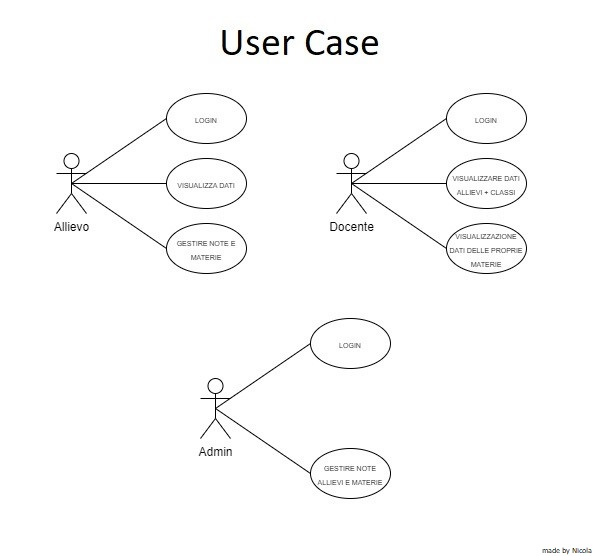
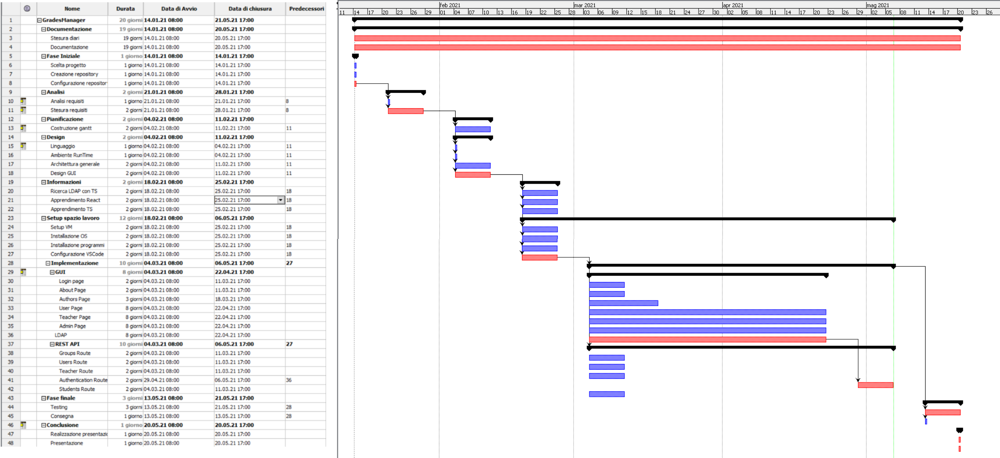
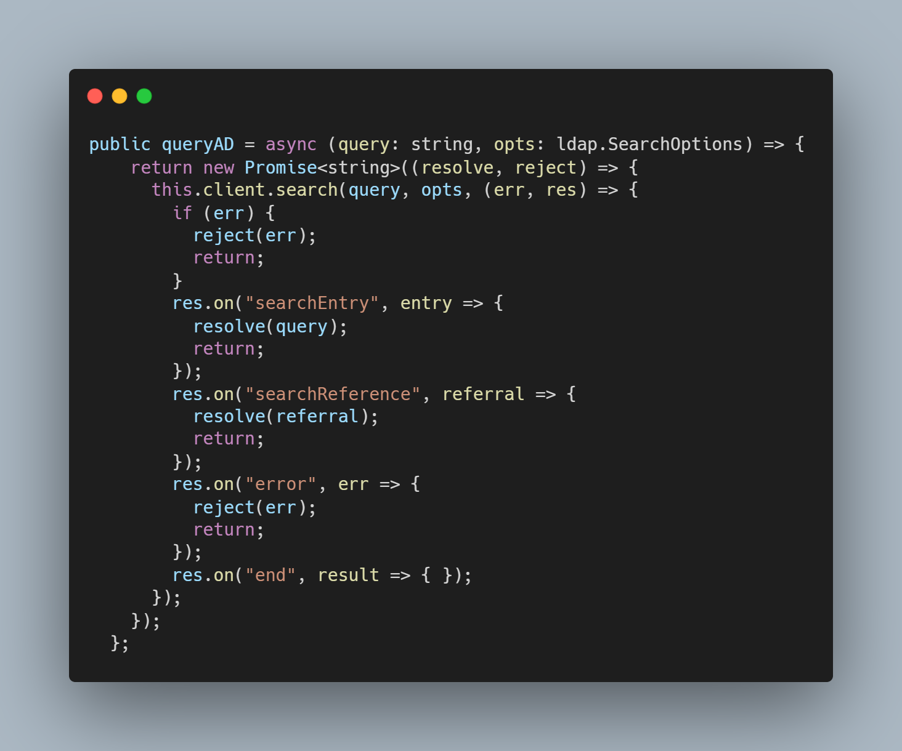
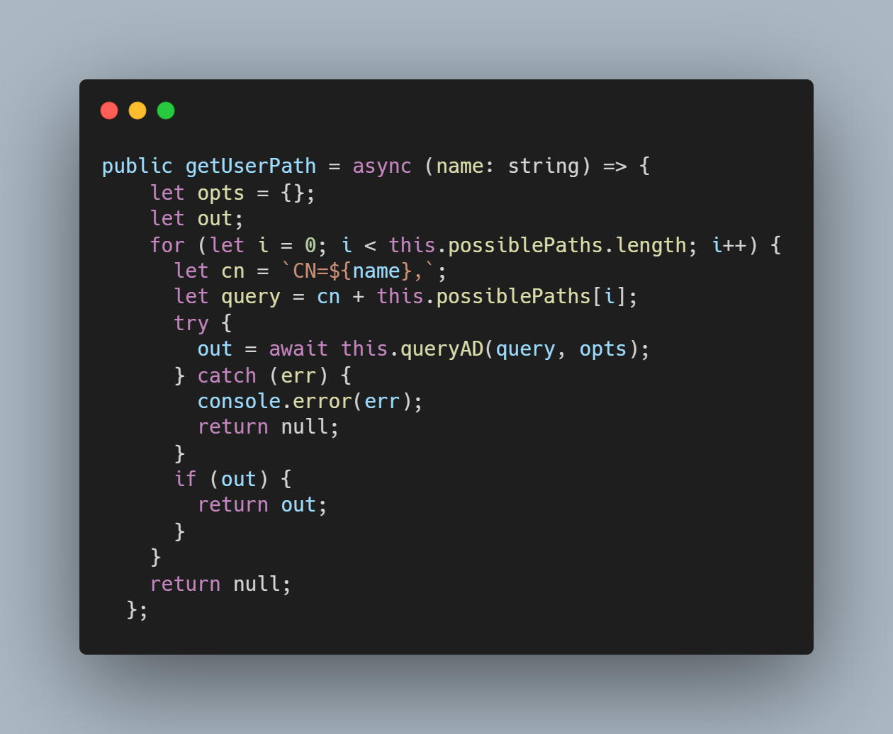
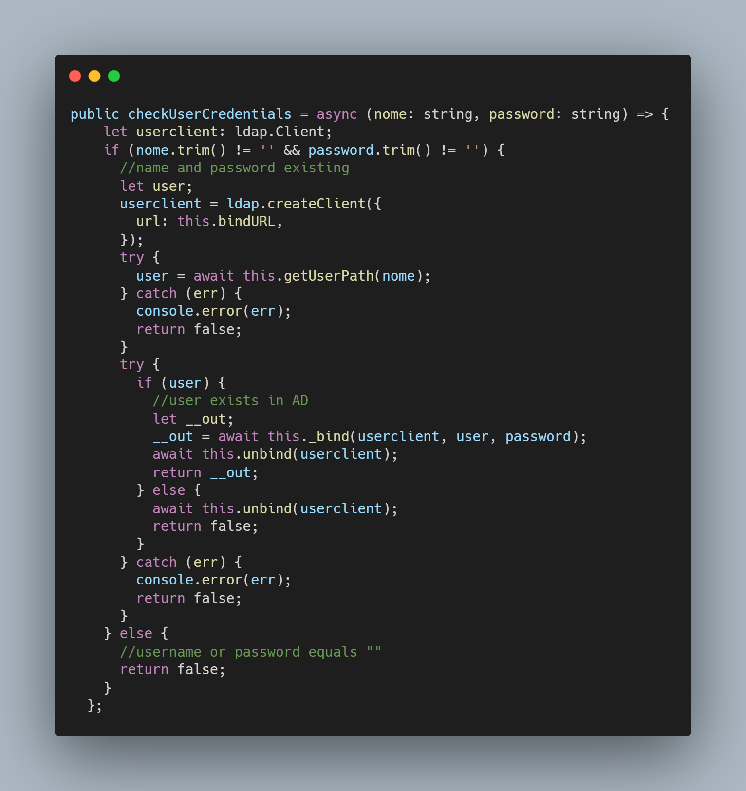
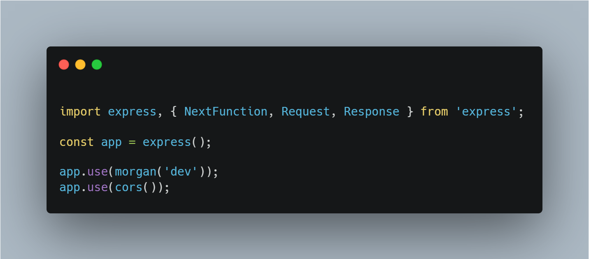
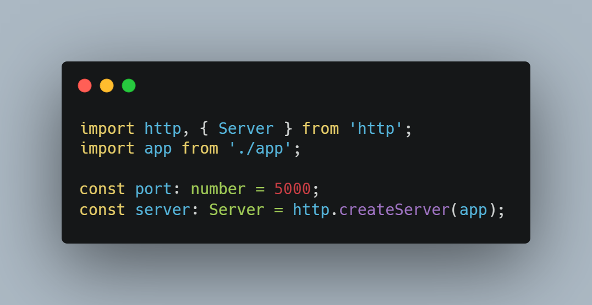
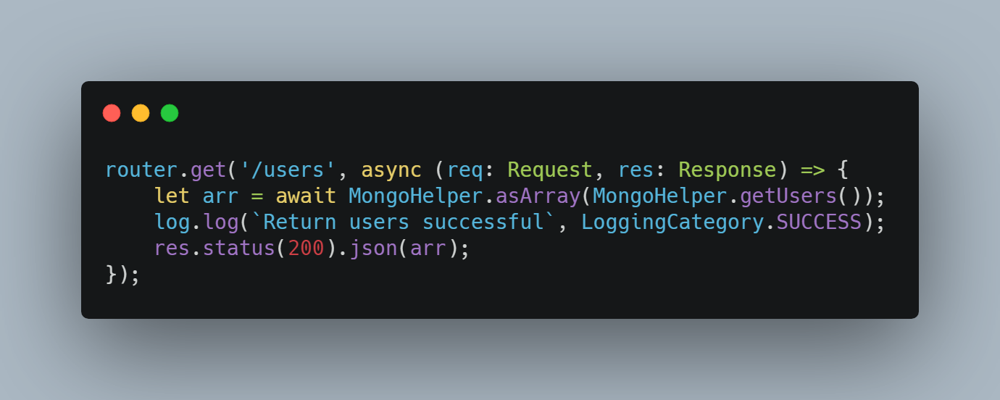
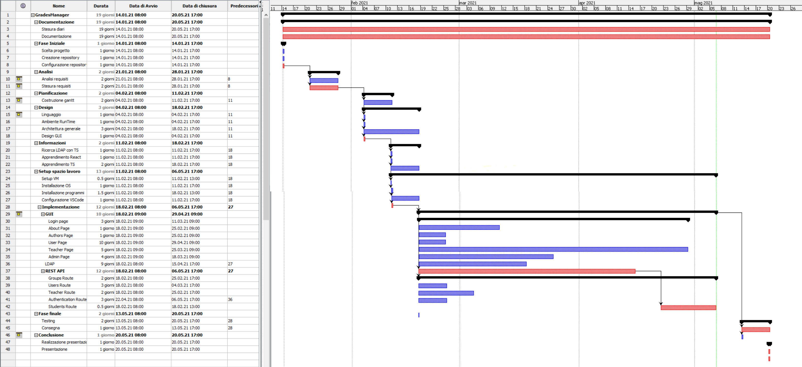

1. [Introduzione](#introduzione)

  - [Informazioni sul progetto](#informazioni-sul-progetto)

  - [Abstract](#abstract)

  - [Scopo](#scopo)

2. [Analisi](#analisi)

  - [Analisi del dominio](#analisi-del-dominio)
  
  - [Analisi dei mezzi](#analisi-dei-mezzi)

  - [Analisi e specifica dei requisiti](#analisi-e-specifica-dei-requisiti)

  - [Use case](#use-case)

  - [Pianificazione](#pianificazione)

3. [Progettazione](#progettazione)

  - [Design dell’architettura del sistema](#design-dell’architettura-del-sistema)

  - [Design dei dati e database](#design-dei-dati-e-database)

4. [Implementazione](#implementazione)

5. [Test](#test)

  - [Protocollo di test](#protocollo-di-test)

  - [Risultati test](#risultati-test)

  - [Mancanze/limitazioni conosciute](#mancanze/limitazioni-conosciute)

6. [Consuntivo](#consuntivo)

7. [Conclusioni](#conclusioni)

  - [Sviluppi futuri](#sviluppi-futuri)

  - [Considerazioni personali](#considerazioni-personali)

8. [Sitografia](#sitografia)

9. [Allegati](#allegati)

## Introduzione

### Informazioni sul progetto

  Questo progetto è realizzato da: Ambrosetti Nicola, Previtali Aris, Trentin Francisco e Viola Francisco, della classe I3A.  Il progetto in questione coinvolge inoltre il docente Luca Muggiasca, che si è occupato di svolgere il ruolo di mandate e di docente responsabile, docente che si occupa di assistere gli allievi durante lo svolgimento del progetto.
  Il progetto viene realizzato a partire dal 14 gennaio 2021 fino al 20 maggio 2021, presso la SAMT (Scuola D'Arti E Mestieri Trevano), nella sezione informatica, per il Modulo 306 + Progetti.
  Durante questo progetto, oltre alla realizzazione verranno tenuti dei diari e una documentazione, che permetteranno di mostrare come e quando gli allievi hanno svolto le determinate attività, nelle diverse sessioni di lavoro.
  Alla fine del progetto verrà svolta una presentazione da parte di tutti gli individui del gruppo, utile per mostrare il risultato finale ottenuto nei mesi di lavoro.

### Abstract

  Nel corso degli anni, la tecnologia e l'informatica han permesso di sviluppare tanti applicativi utili in tutti i settori immaginabili.
  Per il settore scolastico sono state sviluppate delle applicazioni che permettono di marcare tutte le note ottenute nel corso del semestre, filtrandole per materie, docenti o altri parametri ancora.
  Nessuno di questi applicativi hanno però la possibilità di gestire gli utenti di un'intera scuola, permettendo agli utenti di poter accedere in qualsiasi momento, in un qualsiasi luogo, ottenendo tutti le proprie note.
  Questo è infatti lo scopo del nostro progetto, fare in modo che gli utenti, grazie al nome utente e la password usato per l'account dei PC della scuola vengano utilizzati sul applicativo WEB, così che le loro note sono sempre sincronizzate e disponibili, senza dover creare un nuovo account per un ennesimo nuovo servizio.

  >*Over the years, technology and information technology have made it possible to develop many useful applications in every imaginable field.
  For the school sector, applications have been developed that allow you to mark all the marks obtained during the semester, filtering them by subjects, teachers or other parameters.
  None of these applications, however, have the ability to manage the users of an entire school, allowing users to access at any time, anywhere, and get their own notes.
  This is in fact the purpose of our project, to ensure that users, thanks to the username and password used for the school’s PC account, are used on the WEB application, so that their notes are always synchronized and available, without having to create a new account for yet another new service.*

### Scopo

  Lo scopo del progetto è di creare un gestore delle note scolastiche per gli allievi del CPT. Non ne usufruiranno solo gli allievi siccome anche i docenti potranno accedervi e vedere le note di ogni allievo per la specifica materia. Oltre alla gestione delle note, l'applicazione offrirà anche una vista generale ed un andamento dell'allievo così da poter tenere la propria situazione sott'occhio facilmente. Integrando l'Active Directory della scuola ci si assicurerà l'utilizzo solo da utenti registrati nell'infrastruttura scolastica.

## Analisi

### Analisi del dominio

Moltissime app offrono già la possibilità di organizzare le proprie note scolastiche e altro. Spesso però sono per singoli utenti e sono unicamente per dispositivi portatili come i cellulari. Abbiamo quindi l'obiettivo di ampliare queste funzionalità e portare questo tipo di applicativo ad un altro livello. Grazie all'AD della scuola si potranno ottenere le informazioni di login di ogni allievo, docente e persona registrata nell'infrastruttura scolastica. Ogni utente, che è registrato all'intero del sistema informatico scolastico, avrà quindi la possibilità di gestire le proprie note scolastiche che saranno accessibili ovunque grazie all'account di scuola. Per poter usare quest'app sono richieste delle competenze base sull'uso del computer e di un sito web.

### Analisi e specifica dei requisiti
  In base a quanto discusso in classe con il mandante, abbiamo ricavato i seguenti requisiti:
  | **ID**  |**Nome**			|**Priorità**|**Vers**|**Note**  |
  |---------|------------|--------|----|------|
  | Req - 0 | App web | 1 | 1.0 |  |
  | Req - 1 | Prendere dati dall'AD con LDAP | 1 | 1.0 |  |
  | Req - 2 | Utente Allievo | 1 | 1.0 |  |
  | Req - 2.1 | Pagina andamento | 1| 1.0| |
  | Req - 3 | Utente docente | 1 | 1.0| |
  | Req - 3.1 | Possibilità di vedere tutti gli allievi e le loro note | 1 | 1.0 | |
  | Req - 4 | Utente amministratore | 1 | 1.0||
  | Req - 4.1 | Gestione utente | 1 | 1.0 | |
  | Req - 4.2 | Gestione dati e parametri | 1 | 1.0 | |
  | Req - 4.3 | Aggiungere materie e categorie | 1 | 1.0 ||
  | Req - 5 | Aggiungere materie | 1 | 1.0 | |
  | Req - 6 | Aggiungere note con la relativa data | 1 | 1.0||
  | Req - 7 | Filtri | 1 | 1.0 | |
  | Req - 7.1 | In base alle materie (allievi) | 1 | 1.0||
  | Req - 7.2 | In base agli allievi (docenti) | 1 | 1.0 |
  

**Spiegazione elementi tabella dei requisiti:**

**ID**: identificativo univoco del requisito

**Nome**: breve descrizione del requisito

**Priorità**: indica l’importanza di un requisito nell’insieme del
progetto, definita assieme al committente. Ad esempio poter disporre di
report con colonne di colori diversi ha priorità minore rispetto al
fatto di avere un database con gli elementi al suo interno. Solitamente
si definiscono al massimo di 2-3 livelli di priorità.

**Versione**: indica la versione del requisito. Ogni modifica del
requisito avrà una versione aggiornata.

Sulla documentazione apparirà solamente l’ultima versione, mentre le
vecchie dovranno essere inserite nei diari.

**Note**: eventuali osservazioni importanti o riferimenti ad altri
requisiti.

**Sotto requisiti**: elementi che compongono il requisito.

### Use case

 

### Pianificazione

  Prima di iniziare in maniera effettiva a lavorare sulla parte pratica del progetto, tutto il gruppo ha svolta una sorta di riunione che ha permesso a tutti i partecipanti di discutere su varie metodologie per gestire al meglio lo sviluppo del progetto.
  Il gruppo ha quindi deciso di utilizzare diverse metodologie per pianificare al meglio lo svolgimento del progetto.
  La pianificazione del progetto è stata quindi fatta utilizzando un diagramma di Gantt, che permette di suddividere il progetto in fasi, con diverse importanze e priorità.
  Il secondo strumento che il gruppo ha deciso di utilizzare è l'applicativo web Trello, che  permette di suddividere in più fasi tutto ciò che bisogna fare sul arco del progetto, assegnandoli delle etichette, delle categorie, degli utenti e delle cartelle.

  
  Questa è stata la nostra progettazione iniziale. A sinistra possiamo vedere le attività nelle rispettive fasi e a destra i tempi previsti.

  
  Abbiamo provveduto ad utilizzare Trello così da poter gestire il progetto in maniera più dinamica, così da avere tutti un riferimento rispetto ai tempi.
  Inoltre, ad ogni attività abbiamo assegnato il rispettivo responsabile all'interno del gruppo.

### Analisi dei mezzi
  Questi sono i rispettivi mezzi che abbiamo utilizzato: 

  - Node JS (v15.0.6) - Runtime System
  - Visual Studio Code - Editor
  - Postman (v8.0.7) - Utilizzato per il testing delle API
  - MongoDB (v4.4.4) - Utilizzato come DBMS per salvare i dati

  Librerie e package:
  - React
  - LDAPJS
  - Express
  - Cors
  - Morgan

  In modo da poter lavorare in classe nei migliori dei modi, ognuno ha utilizzato il suo portatile personale.
  Una volta finito l'applicativo web, l'idea è quella di metterlo in un server della scuola, così da poterci accedere e connettere anche dall'esterno. 

## Progettazione

### Design dell’architettura del sistema
  Come prima cosa abbiamo pensato di programmare una Web Application. Questo ci avrebbe permesso di poter allocare il sito in un server a scuola, e perciò averlo sempre disponibile. Un altro punto che abbiamo considerato, è che essendo un'applicazione abbastanza semplice da utilizzare, sarebbe stato ottimale poterlo utilizzare anche su altri dispositivi (tablet, smartphone, ecc.).
  Dopo qualche discussione con il nostro gruppo, siamo arrivati alla conclusione che Javascript (più precisamente NodeJS) sarebbe stato il linguaggio adatto alla situazione per diversi motivi.
  Prima di spiegare come abbiamo progettato l'applicazione e tutto il resto del progetto, occorre conoscere diverse nozioni di base sui sistemi che abbiamo utilizzato.
  NodeJS è un runtime costruito sul motore Javascript, che permette di progettare applicazioni di rete scalabili. Il runtime è maggiormente legata ad eventi asincroni, e viene utilizzata per scrivere applicazioni lato server.
  Utilizzare questo framework ci ha quindi condizionati a lavorare con una REST API.  
  Una REST API è invece un interfaccia di programmazione delle applicazioni conformi ai vincoli dell'architettura REST. Per capire bene come funziona una REST API occorre di analizzare il nome in sé:

  **REST (Representational state transfer)** , è uno stile architetturale basato sul protocollo HTTP. Il funzionamento prevede una struttura degli URL ben definita che identifica univocamente una risorsa o un insieme di risorse e l'utilizzo dei metodi HTTP specifici per il recupero di informazioni (GET), per la modifica (POST, PUT, PATCH, DELETE) e per altri scopi (OPTIONS, ecc.). 

  L'API quindi funge da elemento di intermediazione tra gli utenti, i clienti e le risorse che intendono ottenere. In poche parole, viene programmata a lato server, e tramite le route (ovvero le rotte che condurranno ai dati) è possibile andare a pescare le informazioni.
  I motivi principali per cui abbiamo utilizzato questa architettura sono:
  1. Pur essendo un'architettura abbastanza complessa, la separazione tra client e server consente di trattare indipendentemente l'evoluzione dei diversi componenti. La separazione tra client e server si traduce anche in una migliore scalabilità del sistema stesso.
  2. Rende il codice più pulito da leggere, senza query inserite direttamente nel programma e con metodi apposta per  le richieste
  3. Dato che i dati non vengono presi in chiaro, ma tramite una richiesta, il sistema diventa più sicuro grazie ai sistemi di sicurezza implementati nella stessa.

  Una volta definito ciò possiamo passare alla progettazione generale dell'applicazione.

  

  Questo schema riassume il funzionamento generale dell'applicazione. Partendo dall'alto, possiamo trovare il Server Active Directory. Questo server AD corrisponde a quello della scuola. A destra, possiamo trovare il nostro database MongoDB (che descriveremo nel prossimo capitolo). Tramite il protocollo LDAP, ci è stato possibile andare a controllare se un utente effettivamente esiste, e se la sua password corrisponde. Infatti, il protocollo **LDAP (Lightweight Directory Access Protocol)**, si occupa dell'interrogazione dei server directory.
  Sostanzialmente, l'applicazione Web raccoglie i dati inseriti dall'utente (ad esempio il login o le operazioni che esegue all'interno della pagina web) e vengono passati all'API che si occuperebbe a sua volta di interrogare il server AD e di inserire i dati nel database.

  Questo capitolo descrive esaustivamente come deve essere realizzato il
  prodotto fin nei suoi dettagli. Una buona progettazione permette
  all'esecutore di evitare fraintendimenti e imprecisioni
  nell'implementazione del prodotto.

### Design dei dati e database

  In modo da gestire i dati delle materie, dei professori e delle note abbiamo utilizzato un database MongoDB. MongoDB è un database document-based. MongoDB si allontana dalla struttura di db tradizionale basata sulle relazioni tra tabelle, in favore ai documenti in stile JSON con schema dinamico. Utilizzare questo sistema rende in certi casi l'integrazione di dati di alcuni tipi di applicazione più facile e veloce. Dato che abbiamo utilizzato un sistema basato su Javascript, MongoDB calza a pennello con le nostre esigenze.

  Descrizione delle strutture di dati utilizzate dal programma in base
  agli attributi e le relazioni degli oggetti in uso.

### Schema E-R, schema logico e descrizione.

  
  Questa è la rappresentazione del database che abbiamo estrapolato da MongoDB. Come precedentemente accennato, non ci sono tabelle ma utilizziamo le collezioni. 

### Design delle interfacce

  Prima di iniziare con l'implementazione abbiamo cercato di fare degli schizzi di come potrebbe essere l'interfaccia grafica, ottenendo questo risultato:

  

  La prima interfaccia disegnata corrisponde a quella del login, che per il momento abbiamo previsto di poter inserire nome e password come in un semplice login. Nel caso che il login avvenga con successo, se è allievo, viene reindirizzato alla home.
  Come prima cosa, la home possiede un grafico dell'andamento che rappresenta le note con le rispettive medie. Nella sezione inferiore invece troviamo dei blocchetti che rappresentano ogni una una materia. L'idea è quella di poter aggiungere materie semplicemente cliccando su una materia vuote, e di poter editare direttamente dal blocchetto le rispettive informazioni della materia (nome materia, docente, ...). Anche le note prevediamo di poterle aggiungere direttamente dal suo blocchetto. Ogni blocchetto avrà in grande la sua media, e sulla sinistra le note degli ultimi test svolti.
  Nel caso in cui si volesse visualizzare la materia in grande, bisognerà andare nel rispettivo blocchetto e premere l'opzione "visualizzare in grande" nel menu a tendina del blocchetto. Nella visualizzazione della materia singola ci saranno le stesse informazioni del blocchetto singolo, ma nella parte inferiore della pagina ci sarà una tabella con tutte le note per esteso. Nella tabella si potrà anche definire il peso della nota in modo da calcolare correttamente la media anche con pesi diversi.

### Design procedurale

  Andando più nello specifico, come linguaggio abbiamo utilizzato Typescript. Typescript è un linguaggio di programmazione con l'obbiettivo di avere un linguaggio front-end robusto e adatto per applicazioni Javascript complesse. Più nello specifico si tratta di un superset di Javascript che aggiunge classi, interfacce, moduli e i tipi (Da cui deriva il nome Typescript). Inoltre, favorisce il refactoring del codice e ci permette di avere un codice molto pulito con un ottimo controllo dei tipi.
  
  Essendo l'architettura del nostro sistema abbastanza complessa e suddivisa tra front-end e back-and, abbiamo optato per scegliere questo linguaggio. Tuttavia, avere un sito programmato in Typescript e senza nessun tipo di framework non ci sembrava un sistema consistente e quindi abbiamo deciso di utilizzare le librerie di React. React è un web framework utilizzato per la creazione di interfacce utente. Il framework permette di costruire le interfacce utente dinamiche molto complesse, rimanendo comunque semplice e intuitivo da utilizzare.

Descrive i concetti dettagliati dell’architettura/sviluppo utilizzando
ad esempio:

-   Diagrammi di flusso e Nassi.

-   Tabelle.

-   Classi e metodi.

-   Tabelle di routing

-   Diritti di accesso a condivisioni …

Questi documenti permetteranno di rappresentare i dettagli procedurali
per la realizzazione del prodotto.

## Implementazione

  Dopo aver pianificato e progettato tutto possiamo passare all'implementazione. In gran modo possiamo suddividere tutto il lavoro in 3 grandi sezioni:

  - **LDAP**, ovvero tutto ciò che concerne la connessione e l'elaborazione degli utenti affinché si possa fare il login
  - **REST API**, tutto quello che concerne il back-end dell'applicazione, che interagisce con il database e l'LDAP.
  - **React**, tutto ciò che concerne la creazione delle pagine (Typescript, CSS, HTML)

##### ldap-ts
  Uno degli obbiettivi del progetto è permettere che tutti gli allievi e i docenti presenti nell'Active Directory della possano utilizzare il sito. Dopo diverse ricerche abbiamo costatato che la libreria ``LDAPJS`` era la più indicata per il nostro lavoro. Tuttavia questa libreria era abbastanza base e non possedeva tutte le funzionalità che avevamo bisogni, il che ci ha portati a dover creare una nostra libreria che utilizzasse ``LDAPJS`` e in più le funzionalità di cui avevamo bisogno. Queste sono le parti di codice più importanti della nostra libreria ``ldap-ts``:
  - **Binding**: Prima di capire le parti più interessanti del codice occorre capire le fasi di una connessione tramite LDAP. La fase di binding si tratta di un tunnel di comunicazione tra il client e l'Active Directory utilizzato per richiedere e confrontare informazioni. Nella nostra libreria abbiamo fatto il binding in questo modo:

  
  
  Sostanzialmente quello che svolge questo metodo è svolgere il bind utilizzando un percorso di un utente presente nell'Active Directory con la sua password. Infatti per fare un bind bisogna avere le credenziali di un utente all'interno dell'AD che abbia i permessi per svolgere il bind.
  
  - **Cercare utente nell'AD**
  Una volta fatto il bind con il server possiamo già iniziare a fare diverse richieste LDAP. In questo caso ci interessa sapere se un utente esiste nell'Active Directory. Per fare ciò abbiamo sviluppato questo metodo:

  

  Infatti questo metodo, accetta un percorso dell'ActiveDirectory, e ci dice se il percorso è valido (corrisponde a quello dell'AD) oppure no. Questo metodo ritorna una ``Promise``, ovvero è un oggetto che può produrre un singolo valore in un certo momento nel futuro: un valore risolto, o un motivo per cui non è stato risolto (ad esempio, si è verificato un errore di rete).

  - **Ritornare il percorso di un utente**
  Come abbiamo cercato un utente nell'AD, abbiamo fatto anche l'operazione contrapposta. Abbiamo sviluppato un metodo che passando un nome utente (nome.cognome dell'allievo), riesce a ritornarci tutto il percorso di Organisation Unit. Questo metodo ci è stato molto utile prima di tutto per sapere se esiste l'utente nell'AD (fa parte della scuola). Sapendo il percorso dell'allievo in questione, ricaviamo da esso la sezione dell'allievo (Chimica, Elettronica, Informatica..) e la classe (I3AA, D1AA, ...).
  
  

  Dato che non abbiamo trovato delle librerie abbastanza avanzate di LDAP, abbiamo dovuto ricorrere a un metodo molto rudimentale. Infatti, questo metodo fa passare tutti i percorsi possibili dell'AD, e tramite il metodo ``queryAD``, riesce a capire se il percorso è valido. Nel momento in cui il percorso è valido lo ritorna.

  - **Controllare le credenziali dell'utente**
  Il metodo più utile in assoluto è stato questo. Ci ha permesso di svolgere il passaggio più importante, che ci sarebbe servito per il login:

  

  Il metodo accetta il nome e la password. Semplicemente se il nome e la password corrispondono a quelle dell'AD, ritorna true, altrimenti false. Questo metodo è un pò una fusione delle altre funzionalità che abbiamo sviluppato, dato che per arrivare a sviluppare questo metodo, abbiamo avuto bisogno di partire da quelli menzionati in precedenza.

---
##### REST API

Per la parte back-end del nostro progetto abbiamo pensato di sviluppare una REST API la quale serve per gestire il database, creato con MongoDB, e la connessione tramite `ldap` all'AD DS (Active Directory Domain Services) della scuola.
Una REST API si basa sulla creazione di un server e di una app che gestisce le richieste da parte del front-end.
Nel nostro progetto abbiamo utilizzato la libreria npm: `express`, la quale si preoccupa di creare il server della REST API e l'app incaricata di gestire le richieste.

- **App**

- **Server**

Per un utilizzo corretto di una REST API bisogna utilizzare delle route, link diretti al server creato in precedenza le quali eseguono delle funzioni specificate all'interno del codice sorgente. Esse possono avvenire con alcune specifiche e differenti funzioni: `GET`, ``POST``, ``PATCH``, ``DELETE``, ``PUT``.
Ogni route viene specificata tramite la creazione di un router dalla libreria express `express.Router()`.

La REST API si basa sul funzionamento di `http` è quindi ovvio che le route create tramite express vengano basate su di esso (es. Request, Response, status code, ecc.).

Subito dopo aver creato il server e l'app con express, abbiamo creato delle interfaccie con le quale abbiamo specificato e creato dei tipi di variabili con attributi, utilizzabili e molto simili alle classi in `Java` o `C#`. Esse sono stati create in base alla struttura pensata per il salvataggio di dati nel database.

-  **Route**

Molte delle route utilizzano l'accesso al database MongoDB e le sue funzionalità, per ovviare a troppe ripitizioni nelle route e di renderle troppo complicate sia da scrivere che da capire abbiamo deciso di creare un helper con tutti i metodi di cui avevamo bisogno che ci permettono di utilizzare le funzionalità di MongoDB.

---

## Test

### Protocollo di test

  |Test Case      | TC-001                               |
  |---------------|--------------------------------------|
  |**Nome**       |Binding |
  |**Riferimento**|Req - 1                               |
  |**Descrizione**| Fare il binding verso l'ActiveDirectory della scuola.|
  |**Risultati attesi** | Il programma riesce a comunicare con l'ActiveDirectory. |

  |Test Case      | TC-002                               |
  |---------------|--------------------------------------|
  |**Nome**       |Accesso con nome utente o password sbagliate |
  |**Riferimento**|Req - 1                               |
  |**Descrizione**|Acecdere al sistema utilizzando un nome utente o una password errata.|
  |**Risultati attesi** | Il sistema rifiuta l'accesso indicando che il nome utente oppure la password  |

  |Test Case      | TC-003                               |
  |---------------|--------------------------------------|
  |**Nome**       |Accesso con utente allievo, docente e admin. Riesce a riconoscere il suo ruolo |
  |**Riferimento**|Req - 1                               |
  |**Descrizione**|Accedere al sistema utilizzando un utente con il ruolo di allievo, uno con il riolo di docente e infine col ruolo di admin.|
  |**Risultati attesi** | Riesce a riconoscere prima di tutto se esistono, e dopodiché riconosce che ruolo possiedono.  |

  |Test Case      | TC-004                              |
  |---------------|--------------------------------------|
  |**Nome**       | Creazione automatica di un utente quando esso effettua il login |
  |**Riferimento**| *                              |
  |**Descrizione**| Chiamare la route API `authentication` e vedere se crea l'utente correttamente |
  |**Risultati attesi** | Crea l'utente autonomamente nella maniera corretta  |

  |Test Case      | TC-005                              |
  |---------------|--------------------------------------|
  |**Nome**       |  Route `GET` per gli utenti, docenti, gruppi |
  |**Riferimento**| *                            |
  |**Descrizione**| Chiamare la route API `getUsers`, `getTeachers`, `getGroups` e vedere se ritorna gli utenti, i docenti, i gruppi correttamente |
  |**Risultati attesi** | Ritorna in un array tutti gli utenti, docenti, gruppi del db  |

  |Test Case      | TC-006                              |
  |---------------|--------------------------------------|
  |**Nome**       |  Route `POST` per gli utenti, docenti, gruppi |
  |**Riferimento**| *                            |
  |**Descrizione**| Chiamare la route API `createUsers`, `createTeachers`, `createGroups` e vedere se crea l'utente, il docente, il gruppo correttamente |
  |**Risultati attesi** | Crea un utente, un docente, un gruppo con i parametri giusti passati tramite body della richiesta  |

  |Test Case      | TC-007                              |
  |---------------|--------------------------------------|
  |**Nome**       |  Route `PATCH` per gli utenti, docenti, gruppi |
  |**Riferimento**| *                            |
  |**Descrizione**| Chiamare la route API `updateUser`, `updateTeachers`, `updateGroups` e vedere se modifica l'utente, il docente, il gruppo correttamente |
  |**Risultati attesi** | Modifica l'utente, il docente, il gruppo con i parametri giusti passati tramite body della richiesta  |

  |Test Case      | TC-008                              |
  |---------------|--------------------------------------|
  |**Nome**       |  Route `DELETE` per gli utenti, docenti, gruppi |
  |**Riferimento**| *                            |
  |**Descrizione**| Chiamare la route API `deleteUser`, `deleteTeachers`, `deleteGroups` e vedere se elimina l'utente, il docente, il gruppo correttamente |
  |**Risultati attesi** | Elimina l'utente, il docente, il gruppo  |
  
  *nota: nessun riferimento siccome il sistema sta alla base del progetto e fa riferimento a tutti, o quasi, i requisiti
  I test case 005, 006, 007, 008 sono stati generalizzati

### Risultati test

  |Test Case      | TC-001                               |
  |---------------|--------------------------------------|
  |**Nome**       |Binding |
  |**Descrizione**|Il sistema è riuscito a svolgere il binding con successo.|
  |**Passato**|✔                     |

  |Test Case      | TC-002                               |
  |---------------|--------------------------------------|
  |**Nome**       |Accesso con nome utente o password sbagliate |
  |**Descrizione**| Quando si passano nomi o password diverse il sistema non accede e invia un messaggio di errore all'utente.|
  |**Passato**|✔                     |

  |Test Case      | TC-003                               |
  |---------------|--------------------------------------|
  |**Nome**       |Accesso con utente allievo, docente e admin. Riesce a riconoscere il suo ruolo |
  |**Descrizione**| Il sistema riconosce il ruolo dell'utente. |
  |**Passato**|✔                     |

  |Test Case      | TC-004                               |
  |---------------|-------------------------------------- |
  |**Nome**       | Creazione automatica di un utente quando esso effettua il login |
  |**Descrizione**| La route crea l'utente correttamente |
  |**Passato**|✔    

  |Test Case      | TC-005                               |
  |---------------|-------------------------------------- |
  |**Nome**       | Route `GET` per gli utenti, docenti, gruppi |
  |**Descrizione**| La route crea ritorna correttamente gli utenti, i docenti, i gruppi |
  |**Passato**|✔   

  |Test Case      | TC-006                               |
  |---------------|-------------------------------------- |
  |**Nome**       | Route `POST` per gli utenti, docenti, gruppi |
  |**Descrizione**| La route crea correttamente l'utente, il docente, il gruppo con i parametri corretti |
  |**Passato**|✔    

  |Test Case      | TC-007                               |
  |---------------|-------------------------------------- |
  |**Nome**       | Route `PATCH` per gli utenti, docenti, gruppi |
  |**Descrizione**| La route modifica correttamente l'utente, il docente, il gruppo con i parametri corretti |
  |**Passato**|✔ 

  |Test Case      | TC-008                               |
  |---------------|-------------------------------------- |
  |**Nome**       | Route `DELETE` per gli utenti, docenti, gruppi |
  |**Descrizione**| La route elimina correttamente l'utente, il docente, il gruppo |
  |**Passato**|✔ 

### Mancanze/limitazioni conosciute

  Alla fine del nostro progetto ci siamo resi conto di avere alcune mancanze, non influenti sull'utilizzo del prodotto finale.
  *Categorie*: discutendo insieme al professore abbiamo costatato che le categorie non erano definite correttamente, di conseguenza non abbiamo potuto implementarle.
  *Divisione in semestre*: durante l'analisi avevamo pensato di poter suddividere le materie in semestre, ma siccome era un requisito extra l'abbiamo lasciato per la fine dell'implementazione, alla fine però non siamo riusciti ad implementarmi per mancanza di tempo.
  *Ordinare elementi nella tabelle dei docenti e degli admin*: non è possibile fare in modo che si possano ordinare in un determinato modo, voluto dall'utente, gli elementi delle tabelle.
  *Ordinare note nelle tabelle dei docenti*: non è possibile filtrare e ordinare le note in base al loro valore o al loro peso, è però possibile ordinarle tramite la data.
  *Ordinare le materie nella pagina home*: lo studente non ha la possibilità di ordinare in maniera personale le proprie materie, bensì rimangono ordinate a seconda di come vengono create.

## Consuntivo

   
  Questo è il nostro Gantt consuntivo. Come possiamo vedere il Gantt consuntivo è cambiato molto rispetto a quello iniziale.
Rispetto a quanto previsto, abbiamo avuto bisogno di più tempo per progettare l'architettura del prodotto in modo che fosse chiaro per tutti i membri del gruppo.
In quanto all'implementazione, abbiamo lavorato molto per la User Page in modo da farla al meglio. Dato che utilizziamo React, una volta fatto il componente della user
page, abbiamo riciclato il componente per fare le ultime due pagine (Teacher e Admin), e questo ci ha fatto risparmiare qualche ora di lavoro

## Conclusioni
  Il prodotto finale lo reputiamo molto utile. Per un allievo è molto importante tenere conto del suo andamento scolastico, ma potrebbe essere anche un'operazione abbastanza tediosa. Il nostro prodotto riesce a rendere le azioni che potrebbero essere più difficili da tenere conto, in un processo molto più semplice e visivo. Il fatto di possedere un grafico che evidenzi il tuo andamento è anche quello una funzionalità molto utile per un allievo. D'altra parte ci sono anche i docenti, che grazie al nostro prodotto potranno avere una concezione più precisa dell'andamento di ogni allievo, focalizzando tutto su un sistema unico. Un altro punto forte della soluzione è il fatto che sia un applicativo web e come tutti sappiamo, un applicativo web è molto versatile in diversi aspetti. Uno di questi è che vi si può accedere da ovunque, da ogni dispositivo. Pensiamo veramente che sia uno strumento molto utile per la nostra scuola e che ha il potenziale di essere pubblicato e reso disponibili effettivamente. Tuttavia i risultati che abbiamo ottenuti sono fatti a misura per il nostro ambiente e rispettando, ma si potrebbe anche generalizzare per tutte le scuole.

  Quali sono le implicazioni della mia soluzione? Che impatto avrà?
  Cambierà il mondo? È un successo importante? È solo un aggiunta
  marginale o è semplicemente servita per scoprire che questo percorso è
  stato una perdita di tempo? I risultati ottenuti sono generali,
  facilmente generalizzabili o sono specifici di un caso particolare? ecc

### Sviluppi futuri
  Ci sono diverse funzionalità che abbiamo pensato potessero essere interessanti per il nostro progetto, ma che per diversi motivi non sono state implementate:

  - Possibilità di scegliere tra diversi linguaggi
  - Separazione delle note in base ai semestri
  - Note colorate in base alla sufficienza
  - Valutazioni semestrali docenti da parte degli allievi
  - Sviluppare una breve guida per il collegamento del sito alla home (Android e IOS)

### Considerazioni personali
- **Aris Previtali**
  Da questo progetto credo di aver imparato molto, ho utilizzato un nuovo linguaggio di programmazzione lato server per la realizzazzione del progetto: TypeScript basato su JavaScript, con il quale ho lavorato però solo lato web.
  Ho creato, con l'aiuto dei miei compagni, una REST API partendo solo da un'idea vaga di essa e ora capendone il significato e come realizzarla.
  Rispetto al progetto del primo semestro, dove ho lavorato singolarmente, in questo progetto eravamo un team, ho quindi imparato e adattato il mio modo di lavorare. Siamo riusciti a suddividerci bene il lavoro e mi sono trovato bene con il team.
  Credo che questo progetto mi abbia aiutato molto a migliorare le mie capacità di lavoro in team.
- **Francisco Viola**
  In questo progetto ho imparato a vedere più da vicino Typescript, occupandomi io della parte di LDAP del progetto
  (fatta in Typescript). Svolgendo il progetto a gruppi ho anche imparato a gestirmi meglio in un team, e soprattutto
  a utilizzare la piattaforma Github come si deve. Ho capito l'importanza di una buona organizzazione per svolgere
  il progetto al meglio possibile. Inoltre ho approfondito il funzionamento del protocollo LDAP, assieme alla strutture e ai componenti
  di una Active Directory Forest. Sono anche contento di come abbiamo gestito la documentazione, aggiornandola man mano che andavamo avanti col progetto, e non
  documentare tutto all'ultimo. Rispetto a un progetto individuale, svolgerlo a gruppi mi è sembrato più leggero all'ora di lavorare p
- **Nicola Ambrosetti**
  Grazie a questo progetto sono riuscito a migliorare il mio lavorare in gruppo, permettendomi di apprendere nuove nozioni
  fornite dai miei compagni per rendere l'ambiente di lavoro più sereno e tranquillo possibile.
  Siccome abbiamo deciso di utilizzare typescript ho imparato delle nuove nozioni per quel che concerne questo linguaggio.
  React è stata una svolta, che mi ha permesso di semplificarmi notevolmente la mia parte di lavoro.
  Infine tutto quel che concerne l'AD scolastico è stato utile per rinfrescare le mie nozioni lato Active directory, nonostante il mio lavoro non sia stato
  incentrato sulla parte di estraolazione dei dati dal server.
  In conclusione posso dire di aver svolto con molto piacere questo progetto, in quanto mi ha dato molte soddisfazioni e nuove nozioni.

- **Ismael Trentin**
  Grazie a questo progetto ho imparato molte nuove cose di React.  Anche se il progetto non sfrutta al meglio tutte le sue funzionalita' (di React), mi ha permesso di capire cosa non bisogna fare e per il prossimo progetto potro' evitare di fare gli stessi errori. Inoltre, ho capito l'importanza della progettazione siccome, avendo un progetto abbastanza sostanzioso, sarebbe stato un disastro se avessimo iniziato subito a scrivere codice. Anche se preferisco di gran lunga lavorare da solo, questa volta mi e' piaciuto lavorare in gruppo siccome siamo riusciti a divderci bene il lavoro.

## Sitografia
- http://ldapjs.org/, *LDAP JS*, 20-1-2021
- https://www.datensen.com/data-modeling/moon-modeler-for-databases.html, *Moon Modeler*, 
- https://infograph.venngage.com/, *Venngage Graphic Creator*, 02-03-2021
- https://www.serverplan.com/blog/node-js/#gref, *Server plan - NodeJS*, 02-03-2021
- https://it.wikipedia.org/wiki/Lightweight_Directory_Access_Protocol, *Wikipedia*, 09-03-2021
- https://www.npmjs.com, *npm*
- https://carbon.now.sh/, *carbon*

## Allegati

- [Diari](./Diari) 
- [Diario dei compiti](./DiarioDeiCompiti/)
- [Gantt](./Documenti/GradesManager.gan)
 

### Sources
- [APP](./gradesmanager)
- [API](./gmapi)
- [LDAP](./ldap-ts)