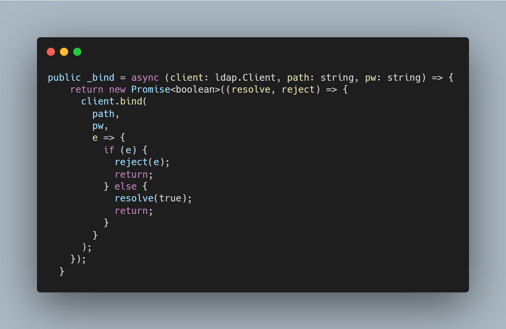

1. [Introduzione](#introduzione)

  - [Informazioni sul progetto](#informazioni-sul-progetto)

  - [Abstract](#abstract)

  - [Scopo](#scopo)

2. [Analisi](#analisi)

  - [Analisi del dominio](#analisi-del-dominio)
  
  - [Analisi dei mezzi](#analisi-dei-mezzi)

  - [Analisi e specifica dei requisiti](#analisi-e-specifica-dei-requisiti)

  - [Use case](#use-case)

  - [Pianificazione](#pianificazione)

3. [Progettazione](#progettazione)

  - [Design dell’architettura del sistema](#design-dell’architettura-del-sistema)

  - [Design dei dati e database](#design-dei-dati-e-database)

4. [Implementazione](#implementazione)

5. [Test](#test)

  - [Protocollo di test](#protocollo-di-test)

  - [Risultati test](#risultati-test)

  - [Mancanze/limitazioni conosciute](#mancanze/limitazioni-conosciute)

6. [Consuntivo](#consuntivo)

7. [Conclusioni](#conclusioni)

  - [Sviluppi futuri](#sviluppi-futuri)

  - [Considerazioni personali](#considerazioni-personali)

8. [Sitografia](#sitografia)

9. [Allegati](#allegati)

## Introduzione

### Informazioni sul progetto

Questo progetto è realizzato da: Ambrosetti Nicola, Previtali Aris, Trentin Francisco e Viola Francisco, della classe I3A.  Il progetto in questione coinvolge inoltre il docente Luca Muggiasca, che si è occupato di svolgere il ruolo di mandate e di docente responsabile, docente che si occupa di assistere gli allievi durante lo svolgimento del progetto.
Il progetto viene realizzati a partire dal 14 gennaio 2021 fino al 20 maggio 2021, presso la SAMT (Scuola D'Arti E Mestieri Trevano), nella sezione informatica, per il Modulo 306 + Progetti.
Durante questo progetto, oltre alla realizzazione verranno tenuti dei diari e una documentazione, che permetteranno di mostrare come e quando gli allievi hanno svolto le determinate attività, nelle diverse sessioni di lavoro.
Alla fine del progetto verrà svolta una presentazione da parte di tutti gli individui del gruppo, utile per mostrare il risultato finale ottenuto nei mesi di lavoro.

### Abstract

Nel corso degli anni, la tecnologia e l'informatica han permesso di sviluppare tanti applicativi utili in tutti i settori immaginabili.
Per il settore scolastico sono state sviluppate delle applicazioni che permettono di marcare tutte le note ottenute nel corso del semestre, filtrandole per materie, docenti o altri parametri ancora.
Nessuno di questi applicativi hanno però la possibilità di gestire gli utenti di un'intera scuola, permettendo agli utenti di poter accedere in qualsiasi momento, in un qualsiasi luogo, ottenendo tutti le proprie note.
Questo è infatti lo scopo del nostro progetto, fare in modo che gli utenti, grazie al nome utente e la password usato per l'account dei PC della scuola vengano utilizzati sul applicativo WEB, così che le loro note sono sempre sincronizzate e disponibili, senza dover creare un nuovo account per un ennesimo nuovo servizio.

  >*Over the years, technology and information technology have made it possible to develop many useful applications in every imaginable field.
  For the school sector, applications have been developed that allow you to mark all the marks obtained during the semester, filtering them by subjects, teachers or other parameters.
  None of these applications, however, have the ability to manage the users of an entire school, allowing users to access at any time, anywhere, and get their own notes.
  This is in fact the purpose of our project, to ensure that users, thanks to the username and password used for the school’s PC account, are used on the WEB application, so that their notes are always synchronized and available, without having to create a new account for yet another new service.*

### Scopo

Lo scopo del progetto è di creare un gestore delle note scolastiche per gli allievi del CPT. Non ne usufruiranno solo gli allievi siccome anche i docenti potranno accedervi e vedere le note di ogni allievo per la specifica materia. Oltre alla gestione delle note, l'applicazione offrirà anche una vista generale ed un andamento dell'allievo così da poter tenere la propria situazione sott'occhio facilmente. Integrando l'Active Directory della scuola ci si assicurerà l'utilizzo solo da utenti registrati nell'infrastruttura scolastica.

## Analisi

### Analisi del dominio

Moltissime app offrono già la possibilità di organizzare le proprie note scolastiche e altro. Spesso però sono per singoli utenti e sono unicamente per dispositivi portatili come i cellulari. Abbiamo quindi l'obiettivo di ampliare queste funzionalita' e portare questo tipo di applicativo ad un altro livello. Grazie all'AD della scuola si potranno ottenere le informazioni di login di ogni allievo, docente e persona registrata nell'infrastruttura scolastica. Ogni utente, che deve essere registrato nella scuola, avrà quindi la possibilità di gestire le proprie note scolastiche che saranno accessibili ovunque grazie all'account di scuola. Per poter usare quest'app sono richieste delle competenze base sull'uso del computer e di un sito web.

### Analisi e specifica dei requisiti
In base a quanto discusso in classe con il mandante, abbiamo ricavato i seguenti requisiti:
  | **ID**  |**Nome**			|**Priorità**|**Vers**|**Note**  |
  |---------|------------|--------|----|------|
  | Req - 0 | App web | 1 | 1.0 |  |
  | Req - 1 | Prendere dati dall'AD con LDAP | 1 | 1.0 |  |
  | Req - 2 | Utente Allievo | 1 | 1.0 |  |
  | Req - 2.1 | Pagina andamento | 1| 1.0| |
  | Req - 3 | Utente docente | 1 | 1.0| |
  | Req - 3.1 | Possibilità di vedere tutti gli allievi e le loro note | 1 | 1.0 | |
  | Req - 4 | Utente amministratore | 1 | 1.0||
  | Req - 4.1 | Gestione utente | 1 | 1.0 | |
  | Req - 4.2 | Gestione dati e parametri | 1 | 1.0 | |
  | Req - 4.3 | Aggiungere materie e categorie | 1 | 1.0 ||
  | Req - 5 | Aggiungere materie | 1 | 1.0 | |
  | Req - 6 | Aggiungere note con la relativa data | 1 | 1.0||
  | Req - 7 | Filtri | 1 | 1.0 | |
  | Req - 7.1 | In base alle materie (allievi) | 1 | 1.0||
  | Req - 7.2 | In base agli allievi (docenti) | 1 | 1.0 ||
  

**Spiegazione elementi tabella dei requisiti:**

**ID**: identificativo univoco del requisito

**Nome**: breve descrizione del requisito

**Priorità**: indica l’importanza di un requisito nell’insieme del
progetto, definita assieme al committente. Ad esempio poter disporre di
report con colonne di colori diversi ha priorità minore rispetto al
fatto di avere un database con gli elementi al suo interno. Solitamente
si definiscono al massimo di 2-3 livelli di priorità.

**Versione**: indica la versione del requisito. Ogni modifica del
requisito avrà una versione aggiornata.

Sulla documentazione apparirà solamente l’ultima versione, mentre le
vecchie dovranno essere inserite nei diari.

**Note**: eventuali osservazioni importanti o riferimenti ad altri
requisiti.

**Sotto requisiti**: elementi che compongono il requisito.

### Use case

I casi d’uso rappresentano l’interazione tra i vari attori e le
funzionalità del prodotto.

### Pianificazione

Prima di iniziare in maniera effettiva a lavorare sulla parte pratica del progetto, tutto il gruppo ha svolta una sorta di riunione che ha permesso a tutti i partecipanti di discutere su varie metodologie per gestire al meglio lo sviluppo del progetto.
Il gruppo ha quindi deciso di utilizzare diverse metodologie per pianificare al meglio lo svolgimento del progetto.
La pianificazione del progetto è stata quindi fatta utilizzando un diagramma di Gannt, che permette di suddividere il progetto in fasi, con diverse importanze e priorità.
Il secondo strumento che il gruppo ha deciso di utilizzare è l'applicativo web Trello, che ti permette di suddividere in più fasi tutto ciò che bisogna fare sul arco del progetto, assegnandoli delle etichette, delle categorie, degli utenti e delle cartelle.

Questa è stata la nostra progettazione iniziale. A sinistra possiamo vedere le attività nelle rispettive fasi e a destra i tempi previsti.

In modo da poter gestire il progetto in un modo più dinamico, abbiamo provveduto a creare una bacheca in Trello, in modo da avere tutti un punto di riferimento rispetto ai tempi. Inoltre, ad ogni attività abbiamo assegnato il rispettivo responsabile all'interno del gruppo.

### Analisi dei mezzi
Questi sono i rispettivi mezzi che abbiamo utilizzato: 

- Node JS (v15.0.6) - Runtime System
- Visual Studio Code - Editor
- Postman (v8.0.7) - Utilizzato per il testing delle API
- MongoDB (v4.4.4) - Utilizzato come DBMS per salvare i dati

Librerie:
- React
- LDAPJS
- Express
- Cors
- Morgan

In modo da poter lavorare in classe nei migliori dei modi, ognuno ha utilizzato il suo portatile personale.
Una volta finito l'applicativo web, l'idea è quella di metterlo in un server della scuola, in modo da poterci accedere e connettere anche dall'esterno. 

## Progettazione

### Design dell’architettura del sistema
Come prima cosa abbiamo pensato di programmare una Web Application. Questo ci avrebbe permesso di poter allocare il sito in un server a scuola, e perciò averlo sempre disponibile. Un altro punto che abbiamo considerato, è che essendo un'applicazione abbastanza semplice da utilizzare, sarebbe stato ottimale poterlo utilizzare anche da telefono.
Dopo qualche discussione con il nostro gruppo, siamo arrivati alla conclusione che Javascript (più precisamente NodeJS) sarebbe stato il linguaggio adatto alla situazione per diversi motivi.
Prima di spiegare come abbiamo progettato l'applicazione e tutto il progetto, occorre conoscere diverse nozioni di base sui sistemi che abbiamo utilizzato.
NodeJS è un runtime costruito sul motore Javascript, che permette di progettare applicazioni di rete scalabili. La runtime è maggiormente legata ad eventi asincroni, e viene utilizzata per scrivere applicazioni lato server.
Utilizzare questo framework ci ha quindi condizionati a lavorare con una REST API.  
Una REST API è invece un interfaccia di programmazione delle applicazioni conformi ai vincoli dell'architettura REST. Per capire bene come funziona una REST API occorre di analizzare il nome in sé:

**REST (Representational state transfer)** , è uno stile architetturale basato sul protocollo HTTP. Il funzionamento prevede una struttura degli URL ben definita che identifica univocamente una risorsa o un insieme di risorse e l'utilizzo dei metodi HTTP specifici per il recupero di informazioni (GET), per la modifica (POST, PUT, PATCH, DELETE) e per altri scopi (OPTIONS, ecc.). 

 

L'API quindi funge da elemento di intermediazione tra gli utenti, i clienti e le risorse che intendono ottenere. In poche parole, viene programmata a lato server, e tramite le route (ovvero le rotte che condurranno ai dati) è possibile andare a pescare le informazioni.
I motivi principali per cui abbiamo utilizzato questa architettura sono:
1. Pur essendo un'architettura abbastanza complessa, la separazione tra client e server consente di trattare indipendentemente l'evoluzione delle diverse componenti. La separazione tra client e server si traduce anche in una migliore scalabilità del sistema stesso.
2. Rende il codice più pulito da leggere, senza query inserite direttamente nel programma e con metodi apposta per  le richieste
3. Dato che i dati non vengono presi in chiaro, ma tramite una richiesta, il sistema diventa più sicuro grazie ai sistemi di sicurezza implementati nella stessa.

Una volta definito ciò possiamo passare alla progettazione generale dell'applicazione.

Questo schema riassume il funzionamento generale dell'applicazione. Partendo dall'alto, possiamo trovare il Server Active Directory. Questo server AD corrisponde a quello della scuola. A destra, possiamo trovare il nostro database MongoDB (che descriveremo nel prossimo capitolo). Tramite il protocollo LDAP, ci è stato possibile andare a controllare se un utente effettivamente esiste, e se la sua password corrisponde. Infatti, il protocollo **LDAP (Lightweight Directory Access Protocol)**, si occupa dell'interrogazione dei server directory.
Sostanzialmente, l'applicazione Web raccoglie i dati inseriti dall'utente (ad esempio il login o le operazioni che esegue all'interno della pagina web) e vengono passati all'API che si occuperebbe a sua volta di interrogare il server AD e di inserire i dati nel database.

Questo capitolo descrive esaustivamente come deve essere realizzato il
prodotto fin nei suoi dettagli. Una buona progettazione permette
all'esecutore di evitare fraintendimenti e imprecisioni
nell'implementazione del prodotto.

  
Descrive:

-   La struttura del programma/sistema lo schema di rete...

-   Gli oggetti/moduli/componenti che lo compongono.

-   I flussi di informazione in ingresso ed in uscita e le
    relative elaborazioni. Può utilizzare *diagrammi di flusso dei
    dati* (DFD).

-   Eventuale sitemap

### Design dei dati e database
In modo da gestire i dati delle materie, dei professori e delle note abbiamo utilizzato un database MongoDB. MongoDB è un database document-based. MongoDB si allontana dalla struttura di db tradizionale basata sulle relazioni tra tabelle, in favore ai documenti in stile JSON con schema dinamico. Utilizzare questo sistema rende in certi casi l'integrazione di dati di alcuni tipi di applicazione più facile e veloce. Dato che abbiamo utilizzato un sistema basato su Javascript, MongoDB calza a pennello con le nostre esigenze.

Descrizione delle strutture di dati utilizzate dal programma in base
agli attributi e le relazioni degli oggetti in uso.

### Schema E-R, schema logico e descrizione.

Questa è la rappresentazione del database che abbiamo estrapolato da MongoDB. Come precedentemente accennato, non ci sono tabelle ma utilizziamo le collezioni. 

### Design delle interfacce

Prima di iniziare con l'implementazione abbiamo cercato di fare degli schizzi di come potrebbe essere l'interfaccia grafica, ottenendo questo risultato:

La prima interfaccia disegnata corrisponde a quella del login, che per il momento abbiamo previsto di poter inserire nome e password come in un semplice login. Nel caso che il login avvenga con successo, se è allievo, viene reindirizzato alla home.
Come prima cosa, la home possiede un grafico dell'andamento che rappresenta le note con le rispettive medie. Nella sezione inferiore invece troviamo dei blocchetti che rappresentano ogni una una materia. L'idea è quella di poter aggiungere materie semplicemente cliccando su una materia vuote, e di poter editare direttamente dal blocchetto le rispettive informazioni della materia (nome materia, docente, ...). Anche le note prevediamo di poterle aggiungere direttamente dal suo blocchetto. Ogni blocchetto avrà in grande la sua media, e sulla sinistra le note degli ultimi test svolti.
Nel caso in cui si volesse visualizzare la materia in grande, bisognerà andare nel rispettivo blocchetto e premere l'opzione "visualizzare in grande" nel menu a tendina del blocchetto. Nella visualizzazione della materia singola ci saranno le stesse informazioni del blocchetto singolo, ma nella parte inferiore della pagina ci sarà una tabella con tutte le note per esteso. Nella tabella si potrà anche definire il peso della nota in modo da calcolare correttamente la media anche con pesi diversi.

### Design procedurale

  Andando più nello specifico, come linguaggio abbiamo utilizzato Typescript. Typescript è un linguaggio di programmazione con l'obbiettivo di avere un linguaggio front-end robusto e adatto per applicazioni Javascript complesse. Più nello specifico si tratta di un superset di Javascript che aggiunge classi, interfacce, moduli e i tipi (Da cui deriva il nome Typescript). Inoltre, favorisce il refactoring del codice e ci permette di avere un codice molto pulito con un ottimo controllo dei tipi.
  
  Essendo l'architettura del nostro sistema abbastanza complessa e suddivisa tra front-end e back-and, abbiamo optato per scegliere questo linguaggio. Tuttavia, avere un sito programmato in Typescript e senza nessun tipo di framework non ci sembrava un sistema consistente e quindi abbiamo deciso di utilizzare le librerie di React. React è un web framework utilizzato per la creazione di interfacce utente. Il framework permette di costruire le interfacce utente dinamiche molto complesse, rimanendo comunque semplice e intuitivo da utilizzare.

Descrive i concetti dettagliati dell’architettura/sviluppo utilizzando
ad esempio:

-   Diagrammi di flusso e Nassi.

-   Tabelle.

-   Classi e metodi.

-   Tabelle di routing

-   Diritti di accesso a condivisioni …

Questi documenti permetteranno di rappresentare i dettagli procedurali
per la realizzazione del prodotto.

## Implementazione

Dopo aver pianificato e progettato tutto possiamo passare all'implementazione. In gran modo possiamo suddividere tutto il lavoro in 3 grandi sezioni:
- **LDAP**, ovvero tutto ciò che concerne la connessione e l'elaborazione degli utenti affinché si possa fare il login
- **API**, tutto quello che concerne il back-end dell'applicazione, che interagisce con il database e l'LDAP.
- **React**, tutto ciò che concerne la creazione delle pagine (Typescript, CSS, HTML)

##### ldap-ts
  Uno degli obbiettivi del progetto è permettere che tutti gli allievi e i docenti presenti nell'Active Directory della possano utilizzare il sito. Dopo diverse ricerche abbiamo costatato che la libreria ``LDAPJS`` era la più indicata per il nostro lavoro. Tuttavia questa libreria era abbastanza base e non possedeva tutte le funzionalità che avevamo bisogni, il ché ci ha portati a dover creare una nostra libreria che utilizzasse ``LDAPJS`` e in più le funzionalità di cui avevamo bisogno. Queste sono le parti di codice più importanti della nostra libreria ``ldap-ts``:
  - **Binding**: Prima di capire le parti più interessanti del codice occorre capire le fasi di una connessione tramite LDAP. La fase di binding si tratta di un tunnel di comunicazione tra il client e l'Active Directory utilizzato per richiedere e confrontare informazioni. Nella nostra libreria abbiamo fatto il binding in questo modo:

  
  
  Sostanzialmente quello che svolge questo metodo è svolgere il bind utilizzando un percorso di un utente presente nell'Active Directory con lasua password. Infatti per fare un bind bisogna avere le credenziali di un utente all'interno dell'AD che abbia i permessi per svolgere il bind.
  
  - **Cercare utente nell'AD**: una volta fatto il bind con il server possiamo già iniziare a fare diverse richieste LDAP. In questo caso ci interessa sapere se un utente esiste nell'Active Direcotry. Per fare ciò abbiamo sviluppato questo metodo:

In questo capitolo dovrà essere mostrato come è stato realizzato il
lavoro. Questa parte può differenziarsi dalla progettazione in quanto il
risultato ottenuto non per forza può essere come era stato progettato.

Sulla base di queste informazioni il lavoro svolto dovrà essere
riproducibile.

In questa parte è richiesto l’inserimento di codice sorgente/print
screen di maschere solamente per quei passaggi particolarmente
significativi e/o critici.

Inoltre dovranno essere descritte eventuali varianti di soluzione o
scelte di prodotti con motivazione delle scelte.

Non deve apparire nessuna forma di guida d’uso di librerie o di
componenti utilizzati. Eventualmente questa va allegata.

Per eventuali dettagli si possono inserire riferimenti ai diari.

## Test

### Protocollo di test

Definire in modo accurato tutti i test che devono essere realizzati per
garantire l’adempimento delle richieste formulate nei requisiti. I test
fungono da garanzia di qualità del prodotto. Ogni test deve essere
ripetibile alle stesse condizioni.

|Test Case      | TC-001                               |
|---------------|--------------------------------------|
|**Nome**       |Import a card, but not shown with the GUI |
|**Riferimento**|REQ-012                               |
|**Descrizione**|Import a card with KIC, KID and KIK keys with no obfuscation, but not shown with the GUI |
|**Prerequisiti**|Store on local PC: Profile\_1.2.001.xml (appendix n\_n) and Cards\_1.2.001.txt (appendix n\_n) |
|**Procedura**     | - Go to “Cards manager” menu, in main page click “Import Profiles” link, Select the “1.2.001.xml” file, Import the Profile - Go to “Cards manager” menu, in main page click “Import Cards” link, Select the “1.2.001.txt” file, Delete the cards, Select the “1.2.001.txt” file, Import the cards |
|**Risultati attesi** |Keys visible in the DB (OtaCardKey) but not visible in the GUI (Card details) |

### Risultati test

Tabella riassuntiva in cui si inseriscono i test riusciti e non del
prodotto finale. Se un test non riesce e viene corretto l’errore, questo
dovrà risultare nel documento finale come riuscito (la procedura della
correzione apparirà nel diario), altrimenti dovrà essere descritto
l’errore con eventuali ipotesi di correzione.

### Mancanze/limitazioni conosciute

Descrizione con motivazione di eventuali elementi mancanti o non
completamente implementati, al di fuori dei test case. Non devono essere
riportati gli errori e i problemi riscontrati e poi risolti durante il
progetto.

## Consuntivo

Consuntivo del tempo di lavoro effettivo e considerazioni riguardo le
differenze rispetto alla pianificazione (cap 1.7) (ad esempio Gannt
consuntivo).

## Conclusioni

Quali sono le implicazioni della mia soluzione? Che impatto avrà?
Cambierà il mondo? È un successo importante? È solo un’aggiunta
marginale o è semplicemente servita per scoprire che questo percorso è
stato una perdita di tempo? I risultati ottenuti sono generali,
facilmente generalizzabili o sono specifici di un caso particolare? ecc

### Sviluppi futuri
  Migliorie o estensioni che possono essere sviluppate sul prodotto.

### Considerazioni personali
  Cosa ho imparato in questo progetto? ecc

## Sitografia

1.  URL del sito (se troppo lungo solo dominio, evt completo nel
    diario),

2.  Eventuale titolo della pagina (in italico),

3.  Data di consultazione (GG-MM-AAAA).

**Esempio:**

-   http://standards.ieee.org/guides/style/section7.html, *IEEE
    Standards Style Manual*, 07-06-2008.

## Allegati

Elenco degli allegati, esempio:

-   Diari di lavoro

-   Codici sorgente/documentazione macchine virtuali

-   Istruzioni di installazione del prodotto (con credenziali
    di accesso) e/o di eventuali prodotti terzi

-   Documentazione di prodotti di terzi

-   Eventuali guide utente / Manuali di utilizzo

-   Mandato e/o Qdc

-   Prodotto

-   …